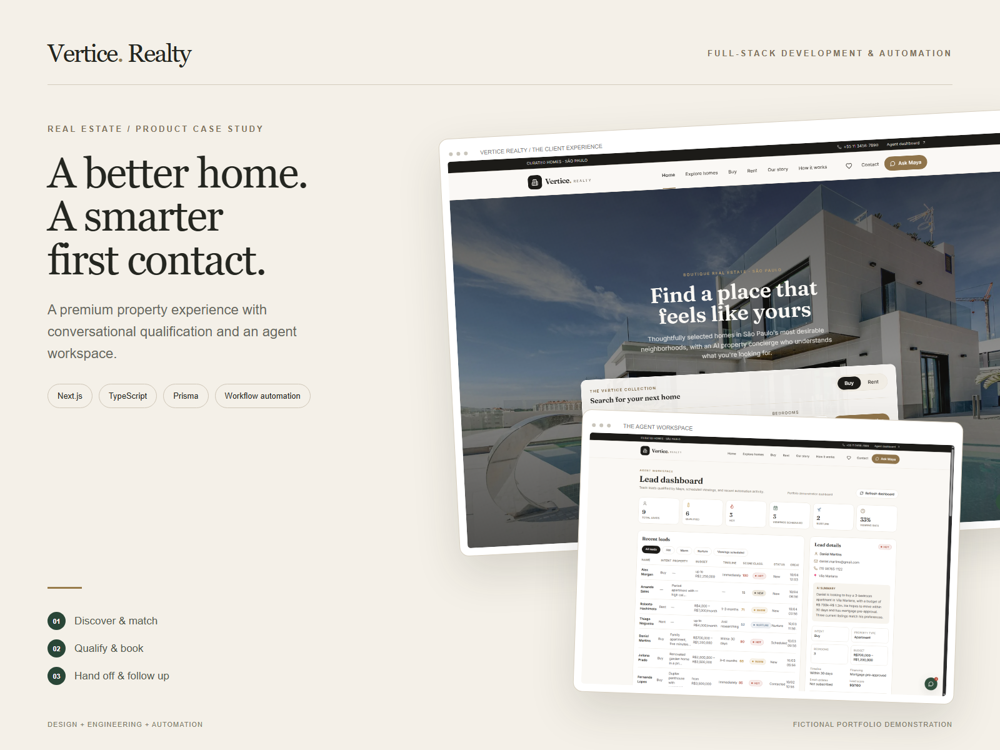

# Vertice Realty

[Live demo](https://vertice-realty.vercel.app) | [Agent dashboard](https://vertice-realty.vercel.app/dashboard?lead=lead-daniel) | [Upwork portfolio kit](portfolio/Upwork-portfolio-kit.zip)

A boutique real estate experience with a working property concierge, deterministic lead qualification, viewing requests and an agent CRM demonstration. Built as an English-language portfolio project for a fictional Sao Paulo agency.



## The business problem

A conventional inquiry form gives agents little context. Vertice collects a visitor's intent, preferred area, budget, timing and readiness before handoff. The system is designed to reduce manual qualification and give agents a useful first-conversation brief. No real-world conversion or revenue results are claimed.

## Features

- 19 detailed listings and 3 fictional agents, with BRL pricing.
- Functional search, sorting, budget and room filters, URL state and empty/error recovery.
- Dynamic property pages, keyboard-accessible gallery and persistent favorites.
- Maya: a progressive, one-question-at-a-time concierge for buying, renting, selling and exploring.
- Editable preferences, contact capture, explicit email-update consent and conversation persistence.
- Deterministic inventory matching and a transparent 0-100 internal lead score.
- HOT/WARM agent handoff and consent-based NURTURE workflows.
- Persistent viewing requests with agent availability, validation, transactional booking and duplicate-slot protection.
- Dashboard metrics, lead details, score explanations, full lead activity, agent notes and status actions.
- Viewing completion/cancellation, with cancelled slots released automatically.
- Responsive layouts, loading states, keyboard focus management and reduced-motion support.
- Metadata, structured data, sitemap, robots rules and conversion-event logging.
- Optional OpenAI reply polishing and server-side webhook adapters.

## Tech stack

Next.js 15 App Router, React 19, TypeScript, Tailwind CSS, Lucide, Prisma 6, SQLite and Zod. No paid service is required for demo mode.

## Local setup

Use Node.js 22 or later. On Windows PowerShell, use `npm.cmd` and `npx.cmd` if script execution is restricted.

```bash
npm install
cp .env.example .env
npm run db:setup
npm run dev
```

PowerShell environment copy: `Copy-Item .env.example .env`. Alternatively, double-click `start.bat` on Windows.

Open http://localhost:3000. For another port: `npm run dev -- --port 3001`.

`db:setup` generates Prisma, synchronizes the schema and seeds the database. **Seeding replaces the selected database's contents**; use it for a fresh demo only. Existing installations can use `npx prisma db push` and `npm run db:translate-demo` to preserve leads and appointments while updating schema and seeded copy.

## Verification

```bash
npm test
npm run typecheck
npm run lint
npm run build
npm run start -- --port 3001
# In another terminal, with the server running:
npm run test:flows
```

Domain tests cover budget parsing, qualification, preference changes, nurture opt-out and input validation. Flow tests exercise the running API and database: matching, lead persistence, retries, booking races, contact forms, agent updates, cancellation, slot release and page responses. They remove only the records created by that run. Leave integration credentials blank when running flow tests. Set `TEST_BASE_URL` to use another local port.

## Architecture and project structure

```text
prisma/                 Schema, English seed overlays and demo seed
src/app/                Public pages, dashboard, API routes, SEO metadata
src/components/
  chatbot/              Conversation UI and inline recommendations
  properties/           Catalog filters, cards, gallery and inquiry form
  scheduling/           Availability and booking confirmation
  dashboard/            Agent status, notes and viewing actions
  home/                 Editorial sections and automation visualization
src/hooks/              Favorites and dialog keyboard behavior
src/lib/
  qualification/        Structured conversational state machine
  matching/             Inventory constraints and ranking
  scoring/              Deterministic lead scoring
  properties/           Shared validated catalog query
  integrations/         Outbound webhook adapters
  validation/           Server request schemas
  automation/           Persistent event log
  ai/                   Optional reply polishing
  availability.ts       Sao Paulo booking dates and demo slots
tests/                  Domain and end-to-end API flow checks
portfolio/              Upwork-ready images, copy and walkthrough
```

The server owns qualification state. Client-supplied state cannot set scores or mark qualification complete. Updating preferences recomputes matches and score on the existing lead. A request identifier lets the client safely replay the most recent chat request after a connection failure.

## Database

Models: Property, Agent, Lead, Appointment, Conversation, Message, AutomationEvent and ContactMessage. Arrays such as amenities and scoring reasons are serialized JSON. SQLite makes the local demonstration self-contained. Appointments use a unique active slot key and a database transaction to avoid duplicate agent bookings.

Local databases, environment files and backups are excluded from Git. The repository contains reproducible fictional seed data, not visitor records.

## Environment variables

| Variable | Purpose |
| --- | --- |
| `NEXT_PUBLIC_SITE_URL` | Public origin for metadata and sitemap |
| `DATABASE_URL` | Required; defaults to `file:./dev.db` in the template |
| `OPENAI_API_KEY`, `OPENAI_MODEL` | Optional natural-language reply polishing |
| `AUTOMATION_WEBHOOK_URL` | Qualified-lead and nurture workflow receiver |
| `WHATSAPP_WEBHOOK_URL` | Agent notification receiver |
| `AGENT_WHATSAPP_NUMBER` | Agent alert destination |
| `EMAIL_WEBHOOK_URL`, `EMAIL_FROM` | Transactional email workflow receiver and sender label |
| `GOOGLE_CALENDAR_WEBHOOK_URL`, `GOOGLE_CALENDAR_ID` | Calendar workflow receiver and calendar |
| `EMAIL_API_KEY` | Reserved; no direct email-provider SDK is implemented |

Empty webhook URLs simulate delivery. `EMAIL_WEBHOOK_URL` falls back to `AUTOMATION_WEBHOOK_URL`. Provider credentials belong in the external workflow, not in browser code.

## Demo mode and optional AI

Maya uses a deterministic conversational engine without API keys. It collects structured answers, accepts edits and recommends only seeded inventory. Optional OpenAI integration rewrites the deterministic text in English; it does not control validation, matching, scoring or database writes. Failed AI calls fall back to the original reply.

WhatsApp, email and calendar operations are simulated when their URLs are empty. Their payloads and activity are visible in server logs and the dashboard. Configured integrations record failures separately instead of treating a rejected request as a delivery.

## Lead scoring

Weights and HOT/WARM thresholds live in `src/lib/constants.ts`. Intent, timeline, financial readiness, profile detail, inventory match and contact completeness contribute to a score capped at 100. HOT is 80+, WARM is 55-79 and NURTURE is below 55. Reasons are stored with the lead. Sensitive personal characteristics are never used.

## Property matching

Purpose, property type, location, minimum/maximum budget and minimum bedrooms are hard constraints. Compatible homes are ranked by relevance and featured status. Empty results remain empty; the assistant does not invent listings. Seller inquiries receive a valuation handoff instead of buyer recommendations.

## Automation integration: n8n, Make or Zapier

1. Create an inbound webhook workflow and copy its URL to the relevant environment variable.
2. Map the lead payload fields to your CRM: `leadId`, `name`, `email`, `phone`, `intent`, `propertyType`, `preferredLocation`, `budgetMin`, `budgetMax`, `bedrooms`, `timeline`, `financingStatus`, `score`, `classification`, `propertyOfInterest`, `matchedProperties`, `source` and `createdAt`.
3. Route qualified records to the agent, and consented nurture records to the email sequence.
4. Return a successful HTTP response only after accepting the work. Use `leadId` to upsert CRM records when preferences change.
5. Keep retries, delivery receipts and long-running schedules in your automation platform.

### WhatsApp

The adapter sends a structured alert with the visitor's requirements, contact, score and suggested next action. Connect the receiver to Meta WhatsApp or Twilio using your own approved account and templates. The local demo does not send real WhatsApp messages.

### Calendar

The adapter includes the viewing date/time, `America/Sao_Paulo` timezone, 60-minute duration, property and attendee. The local database is the availability source. Production calendar conflict checks, two-way synchronization and cancellation delivery require the corresponding external workflow.

### Email nurturing

Visitors explicitly choose whether to receive matching homes and guides. Only opted-in early-stage leads are enrolled. The sequence is day 0: matching properties; day 2: new opportunities; day 5: buying guide; day 10: search follow-up. The demo queues/logs the sequence immediately; it does not run a background email scheduler. Changing email preferences to opt out emits a `nurture_unsubscribed` event to the automation webhook. Configure scheduling and unsubscribe handling in the connected platform before sending real campaigns.

## Portfolio demo flow

1. Search from the homepage and refine the catalog.
2. Open a property, browse its gallery and save it.
3. Start Maya, choose Buy, a matching area/budget, an immediate timeline and cash or approved financing.
4. Share fictional contact details and choose an email preference.
5. Review recommended homes, request agent contact and book a viewing.
6. Open the dashboard to inspect the same lead, explanation and event history.
7. Edit a preference in Maya and observe the existing record update.
8. Show an Exploring lead entering nurture only with email consent.
9. Demonstrate agent notes and viewing cancellation releasing a slot.

## Deployment notes and practical limits

This is a public portfolio demonstration, not a production CRM security boundary. The dashboard and its mutation endpoints intentionally have no staff authentication. Add authentication, authorization, rate limits, retention controls and verified webhook delivery before exposing real client data. The fictional contact links, testimonials and agents must be replaced for a real agency.

### Vercel deployment

The Vercel demonstration uses a dedicated Neon PostgreSQL database on its Free plan. Local development continues to use SQLite. `vercel.json` runs `npm run build:cloud`, which derives a PostgreSQL schema from the canonical SQLite model and generates the matching Prisma client before building Next.js. Schema generation does not reset or seed the database.

For a fresh deployment, connect a new PostgreSQL database to the Vercel project as `DATABASE_URL`. In an isolated setup checkout, generate the cloud client with `node scripts/prepare-cloud.mjs`, apply the schema with `npx prisma db push --schema prisma/schema.cloud.prisma`, and seed that new, empty database once. Never seed over an existing database. Set `NEXT_PUBLIC_DEMO_MODE=true` in Vercel for the fictional-data notice. Metadata uses `NEXT_PUBLIC_SITE_URL` or Vercel's production hostname automatically.

Use `npm run db:generate` to return to the SQLite client if switching a setup checkout back to local development. Keep cloud credentials out of Git. Retain a persistent Node.js host if deploying with SQLite instead. Static HTML export is unsupported. Listing photography loads from remote sources with a visual fallback when unavailable.

## Portfolio assets

See [portfolio/README.md](portfolio/README.md) for screenshots and [portfolio/UPWORK.md](portfolio/UPWORK.md) for English project copy. Captures use a separate database containing only fictional demo records.

Vertice Realty is a fictional brand. This project demonstrates implementation capabilities and makes no claims of measured client business results.
